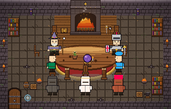
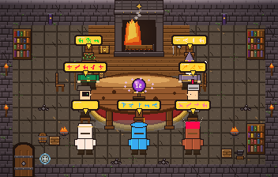
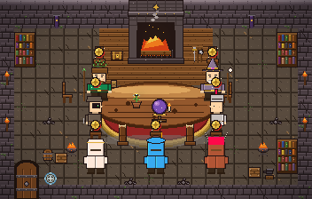
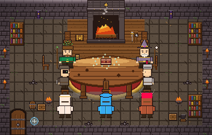

# El Consejo de los 7 Sabios

> Cuando estás atascado, convocas al consejo. 7 sabios con visiones opuestas
> debaten sobre tu proyecto, firman cuando llegan al 100% de acuerdo, un juez
> sintetiza el plan, y se ejecuta — autónomamente o con tu aprobación.



---

## Qué es esto

Un sistema de revisión técnica multi-agente con **incentivos opuestos por
diseño**: si todos los agentes quieren "mejorar el código", coinciden en
obviedades; si tienen visiones que chocan, el debate produce señal real.

Los 7 sabios (cada uno con expertise específica + un foil natural):

| Sabio | Defiende | Foil |
|-------|----------|------|
| **Architect** | Estructura, capas, abstracciones | Simplifier |
| **Conservative** | Estabilidad, "no toques lo que funciona" | Modernizer |
| **Modernizer** | Stack al día, patrones actuales | Conservative |
| **Simplifier (YAGNI)** | Borrar código, menos abstracciones | Architect |
| **Guardian** | Validación, errores, seguridad | Optimizer |
| **Optimizer** | Velocidad, memoria, escalabilidad | Guardian |
| **Ambassador (UX/DX)** | Claridad de APIs, ergonomía | Architect |

Cada sesión, los 7 se sientan **aleatoriamente** alrededor de la mesa.



---

## Mecánica del debate

1. **Análisis**: cada sabio escanea el repo desde su expertise (libro
   flotante en pantalla mientras pasa páginas)
2. **Propose**: ronda 1, cada sabio propone 1-3 mejoras
3. **Sign or reject**: rondas 2+, cada sabio re-lee TODAS las propuestas y
   firma SOLO si está 100% de acuerdo; si no, añade enmiendas
4. **Convergencia**: cuando los 7 firman → juez sintetiza. Si supera 30
   rondas, el umbral baja gradualmente
5. **Ejecución**: 2 modos
   - `auto`: el consejo crea una rama `consejo/<ts>` y commitea las tareas
     SAFE — `master` jamás se toca
   - `manual`: solo genera el reporte priorizado para revisión humana



---

## Quick start

### Launch desde VSCode / Cursor

`Ctrl+Shift+B` está atado (vía `keybindings.json` de usuario) a la tarea
**"Consejo: debatir el workspace abierto"**, que lanza el debate real en una
ventana **externa** — ver [`/invoco-al-consejo`](#invoco-al-consejo--lanzamiento-externo-recomendado) abajo.
El `tasks.json` del proyecto tiene además 4 tareas de desarrollo en
`Ctrl+Shift+P > Run Task`:

- **Consejo: invocar (mock, animado)** — sin API, animación TUI
- **Consejo: invocar (claude-code, animado, 2 rondas)** — debate real via Claude Code CLI
- **Consejo: invocar (mock, headless)** — solo logs
- **Consejo: tests** — pytest

Estas 4 tareas de desarrollo corren en el terminal integrado de VSCode.

### `/invoco-al-consejo` — lanzamiento externo (recomendado)

`Ctrl+Shift+B` ya **no** corre el debate dentro de VSCode. Lanza `consejo.bat`
en una **ventana cmd externa**, de modo que el debate **sobrevive si VSCode se
actualiza o crashea** (correrlo en el terminal integrado lo mataba a media
sesión). Además abre **una segunda ventana** que sigue el debate en vivo, turno
a turno y formateado (`watch-debate.ps1`, espera sola a que arranque el debate).

- **Debate:** opus, `--consensus-rounds 8 --consensus-min-rounds 5`,
  `--json-schema` OFF (los sabios leen el repo de verdad).
- **Plan final:** `consejo-report-*.md` en el cwd — incluye la sección
  **"Puntos de impacto"** con los archivos que toca cada tarea (handoff directo
  a quien implemente).
- **Log en vivo:** `consejo-debate-<timestamp>.jsonl` (lo que sigue la 2ª ventana).

Lanzamiento manual equivalente (sin VSCode): doble-clic en **`consejo.bat`**
(abre el watcher automáticamente). Para seguir un debate ya en curso desde otra
terminal: doble-clic en **`watch-debate.bat`**.

### Launch desde scripts

Hay wrappers en `scripts/`:

```powershell
.\scripts\run-consejo.ps1                              # prompt interactivo
.\scripts\run-consejo.ps1 -Atasco "fix auth" -Mode claude-code
```
```bash
./scripts/run-consejo.sh "fix auth"
MODE=claude-code ./scripts/run-consejo.sh "fix auth"
```

### Quick start manual

**PowerShell (Windows):**

```powershell
git clone https://github.com/Llicklair/consejo-7-sabios
cd consejo-7-sabios
python -m venv .venv
.venv\Scripts\pip install -e .
python -m consejo.sprites
python -m consejo.sound

consejo "El módulo auth tiene 800 líneas y los tests son frágiles" `
  --mode mock --rounds 3 --speed 0.7
```

**bash / zsh (macOS, Linux):**

```bash
git clone https://github.com/Llicklair/consejo-7-sabios
cd consejo-7-sabios
python -m venv .venv
.venv/bin/pip install -e .
python -m consejo.sprites
python -m consejo.sound

consejo "El módulo auth tiene 800 líneas y los tests son frágiles" \
  --mode mock --rounds 3 --speed 0.7
```

**Tres modos disponibles:**

| `--mode` | Requiere | Calidad del debate |
|----------|----------|--------------------|
| `mock` | nada | canned + archivos reales del repo |
| `real` | `pip install anthropic` + `ANTHROPIC_API_KEY` | Sonnet 4.6 sabios + Opus 4.7 juez |
| `claude-code` | CLI `claude` en PATH (sin API key) | 7 visibles + 2 voice-only · 2 rondas threaded |

```bash
consejo "..." --no-ui --mode mock                          # headless
consejo "..." --mode mock --execute auto                   # auto-commits SAFE
consejo --problem "Auth module is 800 lines" --mode mock   # English alias
```

Requiere terminal con truecolor + Unicode: Windows Terminal, WezTerm,
iTerm2. `cmd.exe` clásico no. El canvas es 352×112 chars; si tu terminal
es más pequeño, la escena se reduce automáticamente para encajar.

### ¿Por qué identificadores en español?

El user-facing surface (CLI, reportes) está en español; los prompts del
modelo van en inglés porque Claude rinde mejor ahí. Los `sage_id`
(`arquitecto`, `embajador`, etc.) son ES; los `name_en` (`Architect`,
`Ambassador`) son EN. El flag `--problem` es el alias EN del posicional
`atasco` para que un colaborador no-hispanohablante pueda usar el CLI
sin adivinar.

---

## Modo `--mode real` (Anthropic SDK)

```powershell
$env:ANTHROPIC_API_KEY = "sk-ant-..."     # PowerShell
```
```bash
export ANTHROPIC_API_KEY=sk-ant-...        # bash / zsh
```
```cmd
setx ANTHROPIC_API_KEY "sk-ant-..."        # cmd.exe (permanente, reabrir shell)
```

```bash
consejo "tu atasco en español" --mode real --rounds 3
```

- Sabios usan **Claude Sonnet 4.6** (paralelo, calidad solida en debate)
- Juez usa **Claude Opus 4.7** (síntesis y clasificación de riesgo)
- Timeout + retry exponencial + validación de schema; outputs malformados se
  descartan limpiamente (no crashean el debate)
- Traducción ES→EN del atasco al inicio y EN→ES del plan al final
- El reporte incluye transcripción original (EN) para auditar lo dicho

Get a key: <https://console.anthropic.com/settings/keys>. Nota: una
suscripción Pro/Max **no** incluye créditos de API — se factura aparte.

## Modo `--mode claude-code` (sin API key)

Si tienes el CLI [`claude`](https://docs.claude.com/claude-code) instalado y
una sesión Pro/Max activa, este modo orquesta 7+2 subagentes vía `claude -p`
— sin API key, usando los tokens de tu suscripción.

```bash
consejo "tu atasco" --mode claude-code --cc-model sonnet --rounds 2
```

- **9 voces**: los 7 sabios visibles + Diseñador y Estratega (voice-only,
  no aparecen en la escena pero sí en el reporte)
- **2 rondas**: round 1 propose en paralelo, round 2 cross-examination
  threaded (cada sabio endorses/challenges/amendments las propuestas del resto)
- Cada sabio ejecuta como subprocess `claude -p` con `Read,Glob,Grep`
  permitidos (read-only) y `--json-schema` constrained output
- Disensos aparecen como `unresolved_disagreements` en el reporte

---

## Pixel-art en terminal

La sala es una mazmorra con:
- Chimenea con fuego de 3 frames cicládos (chisporroteo)
- Halos cálidos que pulsan sobre antorchas + braziers
- Mesa enorme con palantir + planta brillante + vela + pergaminos
- Suelo de madera frente a la chimenea, suelo de piedra con 4 variantes
- 4 librerías grandes contra los muros laterales
- Runa mágica brillante en el suelo
- Decoración: anvil, barril, cajas, cofres, calaveras, banners



Estados de la escena (10):
`ENTRANDO → SENTANDOSE → ANALIZANDO → DEBATE×N → JUEZ → ACUERDO → LEVANTANDOSE → SALIENDO → REPORTE`

Cada estado tiene sus propios sonidos procedurales (sin assets externos):
crackle de chimenea, page turn, magic sparkle, palantir hum, seal thump,
chair creak, door creak, quill writing. Vía `pygame.mixer` con fallback a
`winsound` stdlib.

---

## Arquitectura

Ver [ARCHITECTURE.md](ARCHITECTURE.md) para el documento completo.

```
src/consejo/
├── sages.py             — 7 visibles + 2 voice-only (ALL_SAGES)
├── sprites.py           — Sprites/tiles procedurales (PIL)
├── scene.py             — Composición de escena dungeon
├── frames.py            — API pública de render_frame (split for testability)
├── animator.py          — Bucle Rich Live + sound triggers
├── states.py            — Enum State + StateEvent + timings
├── bus.py               — EventBus + Publisher protocol
├── drivers/mock.py      — Mock driver (canned sequence)
├── orchestrator.py      — Consejo real (mock + real hardened + briefing per-sage)
├── claude_code_driver.py — Modo claude-code (7+2 subagents via CLI)
├── translator.py        — Pipeline ES↔EN (Haiku)
├── executor.py          — Modo auto: git async + sanitización de payloads
├── sound.py             — Sonido procedural polifónico
├── glyphs.py            — Idioma rúnico inventado
├── renderer.py          — Asset loaders + decompression-bomb guard
└── cli.py               — `consejo` entry point (Typer-ready argparse)

prompts/
├── sage_template.md     — System prompt unificado (interpolado por sabio)
└── judge.md             — Síntesis del juez

tests/
└── test_council_snapshot.py — invariantes del pipeline mock (10 tests)
```

---

## Red de seguridad (modo auto)

1. ✅ Rama aislada `consejo/<ts>` — `master` jamás se toca
2. ✅ Snapshot pre-consejo si había cambios sin commitear
3. ✅ Cada tarea SAFE = 1 commit atómico (revertir trivial)
4. ✅ Autor `Sabio: <Name>` — auditabilidad por origen
5. ✅ Solo SAFE auto-ejecutables; MEDIUM/RISKY quedan en reporte
6. ✅ Cap duro (`--max-execute-tasks N`, default 10)
7. ✅ El merge a `master` lo haces TÚ a mano tras revisar

---

## Estado

- **Fase 2 (visual + audio)**: ✅ completo
- **Fase 1 (consejo real)**: ✅ mock end-to-end con archivos reales del repo · ✅ `--mode real` hardened (timeout + retry + schema validation) · ✅ `--mode claude-code` con 2 rondas threaded
- **Roster**: 7 visibles + 2 voice-only (Diseñador, Estratega)
- **Real executor agent** (Claude implementa SAFE tasks de verdad, no
  commits vacíos): ⏳ pendiente
- **Versión inglesa del repo**: ⏳ planeada

---

## Licencia

MIT (pendiente de añadir el archivo).
